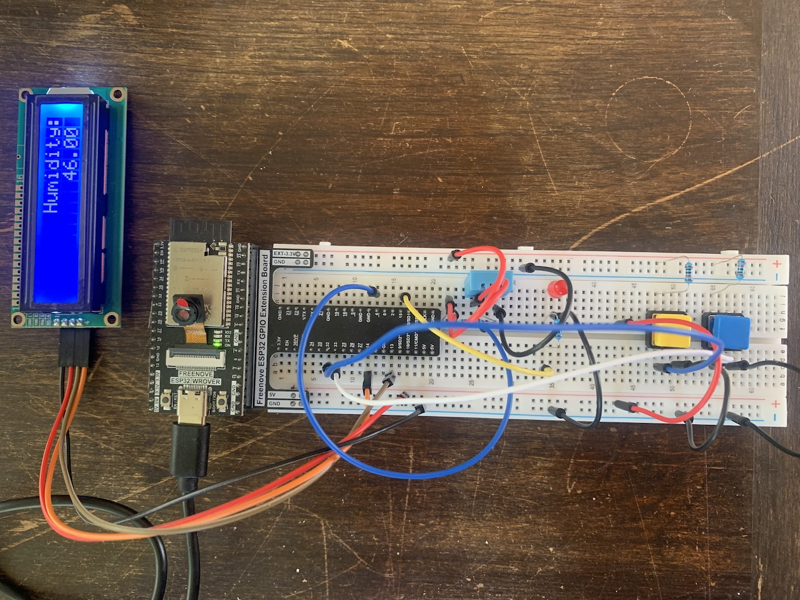

# Projekt



Öppna filen `project_hires.jpg` för en högupplöst variant.

## Bakgrund

Vi bor på landet i ett litet hus uppe i skogen.

Nedervåningen är en ombyggd källare där det finns sovrum, en tvättstuga
och en hall. I framförallt tvättstugan så saknas det radiatorer och vi
har en avfuktare som står på där mer eller mindre hela tiden.
Därav min idé till avslutande projekt.

## Tillämpning

Huvudsyftet är att använda DHT11 (sensor för luftfuktighet och temperatur).
Via denna sensor så mäter jag värden vid ett givet intervall. Internt så
sparas mätvärden för en rullande period om 6 dagar. För varje dag så sparas
senaste värde, medelvärde, lägsta värde samt högsta värde. Man håller också
reda på medelvärde, lägsta värde och högsta värde för totalen.

Via en LCD1602 så kan man bläddra igenom samtliga värden för aktuell dag.
Detta görs genom en knapp (som på min bild är blå).

Mitt primära intresse är att hålla koll på luftfuktighet. Om den understiger
30 (vilket inte är så sannolikt i mitt fall) eller överstiger 60 så tänds en
röd varnings-LED för att man ska få en direkt indikation på att luftfuktigheten
inte är optimal. Inledningsvis så använde jag en aktiv buzzer, men resten av
familjen uppskattade inte det under utvecklingen, så jag bytte till en LED.

På brädan finns också en knapp (som på min bild är gul) som kan användas för
att stänga av (eller sätta på) allt som lyser. Trycker man på den när allt är
på så stänger man av bakgrundsbelysningen på LCD1602 samt varnings-LED om den
är aktiv. Så länge som allt är i läge "av" så kommer inte varnings-LED att tändas
även om luftfuktigheten under- eller överstiger intervallet ovan.

I samband med att systemet startar så aktiveras också Wi-Fi (ett öppet) Soft-AP.
Vi har inget bredband (eller nätverk) i huset, så detta används för att koppla
upp mot ESP32. Samtidigt som Wi-Fi aktiveras så startas också en HTTP-server.
Via denna HTTP-tjänst (`http://192.168.4.1`) så får man samtliga värden och lite
övrig statistik i form av [JSON][1]. På detta sätt så kan man bearbeta dessa
vidare i t.ex. Python, Excel eller motsvarande och på så vis för statistik över
en längre period än vad som sparas internt på ESP32.

## Implementationsdetaljer

Varje komponent (ur ett mjukvaruperspektiv) kör i en egen task. Detta är bl.a.
smidigt då olika hårdvarukomponenter kräver sin egen timing m.m. Logik för DHT11,
LCD1602 samt knapparna kör i en egen task. Man kommunicerar mellan dessa tasks
m.h.a. köer. Det finns två styken köer. En för LCD1602 som används för att
uppdatera själva LCD:n, och en s.k. `main`. Det är via `main` som all data-
synkronisering sköts. Mätvärden från DHT11 hamnar här samt förfrågningar via
HTTP. På detta sätt så behövs ingen mutex då allt tillstånd uppdateras på ett
och samma ställe och då ett meddelande på kön tas om hand i tur och ordning.

## Konfiguration

Det bästa är att öppna den högupplösta bilden `project_hires.jpg`.

### DHT11

- Pinne 1 (VCC) är kopplad till 3V3.
- Pinne 2 (SDA) är kopplad via 3V3 med en 10KΩ resistor och sedan till GPIO 4.
- Pinne 3 (NC) är inte kopplad vidare.
- Pinne 4 (GND) är kopplad till jord.

### LCD1602

- Pinne 1 (GND) är kollad till jord.
- Pinne 2 (VCC) är kopplad till 5V.
- Pinne 3 (SDA) är kopplad till GPIO 13.
- Pinne 4 (SCL) är kopplad till GPIO 14.

Som I2C-port används `I2C_NUM_0` och intern pull-up är aktiverad i konfiguration
för I2C.

### Varnings-LED

- Katod är kopplad till jord.
- Anod är kopplad via en 220Ω resistor till GPIO 4.

### Knappar

Förutom extern pull-up så används också intern pull-up.

#### Gul knapp

Denna används för att tända och släcka LCD1602 samt varnings-LED.

- Ena sidan är kopplad till jord.
- Den andra sidan är kopplad till 3V3 via en 10KΩ resistor och sedan till GPIO 32.

#### Blå knapp

Denna används för att växla mellan vilka aktuella värden som visas på LCD1602.

- Ena sidan är kopplad till jord.
- Den andra sidan är kopplad till 3V3 via en 10KΩ resistor och sedan till GPIO 33.

### Wi-Fi

- SSID är `ESP32-WROVER`
- Kanal 1
- Inget lösenord
- Max två uppkopplingar

### Fallgropar

DHT11 är känslig och fungerar inte alltid som den ska. I alla fall min. Jag lade också
mycket tid på att försöka få den att fungera och trodde att den var helt trasig tills
jag hittade en GPIO där den helt plötsligt fungerade. Dessa GPIO skilde sig inte åt
enligt databladet, och jag vet att andra också haft liknande problem.

Default konfiguration för ESP32 och FreeRTOS har en tick rate 100Hz vilket gör att
delays kortare än 10ms kan bli allt mellan 0ms och 10ms (se [här][2]).

```python
assert(int((5 * 100) / 1000)) == 0
```

Detta gör det omöjligt vad gäller timing för vissa sensorer. P.g.a. detta så har jag
i vissa fall då det krävs använt en spinning delay.

```c
#define NOP() asm volatile("nop")

void spin_delay(uint64_t us) {
  uint64_t m = (uint64_t)esp_timer_get_time();
  uint64_t e = (m + us);
  if (m > e) {
    while ((uint64_t)esp_timer_get_time() > e) {
      NOP();
    }
  }

  while ((uint64_t)esp_timer_get_time() < e) {
    NOP();
  }
}
```

[1]: https://www.json.org/json-en.html
[2]: https://esp32developer.com/programming-in-c-c/delays/delays
