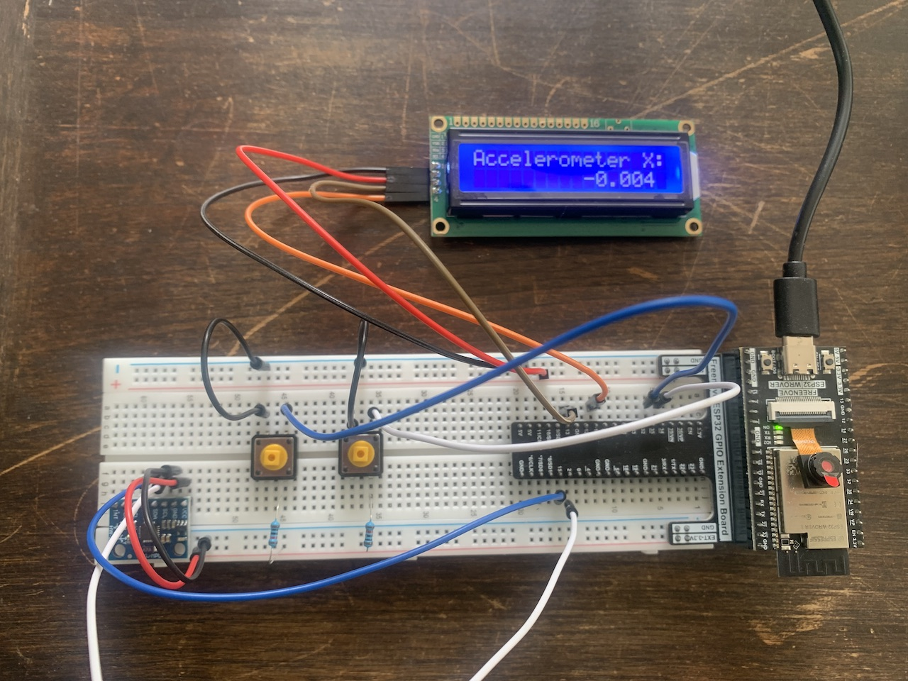

# Uppgift 2

Här kommer mitt lösningsförslag för uppgift 2.

## Konfiguration

### Pinnar

- GPIO 13 är kopplad till LCD1602 SDA
  - Intern pull-up
- GPIO 14 är kopplad till LCD1602 SCL
  - Intern pull-up
- GPIO 15 är kopplad till MPU6050 SDA
  - Intern pull-up
- GPIO 2 är kopplad till MPU6050 SCL
  - Intern pull-up
- GPIO 34 är kopplad till knapp för att växla till föregående värde
  - Intern pull-up samt en 10KΩ (pull-up) resistor kopplad till V3V
- GPIO 35 är kopplad till knapp för att växla till nästa värde
  - Intern pull-up samt en 10KΩ (pull-up) resistor kopplad till V3V

### Portar för I2C

- LCD1602 använder `I2C_NUM_0`
- MPU6050 använder `I2C_NUM_1`
